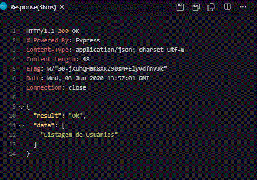

# Para usar o RestClient - Extensão VsCode:

[x] - criar um arquivo com extensão '.http'

`exemplo: 'http://localhost:3030/users'`

[x] - para executar o teste da rota e obter o retorno: 

comando: `Crtl + Alt + R`

[x] - No lado esquerdo abrirá um arquivo com as informações
da requisição e também com o retorno da API

exemplo de retorno: 

